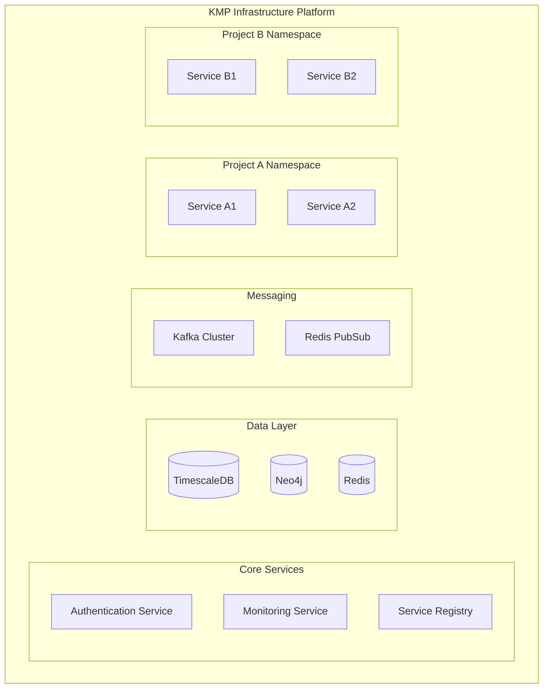
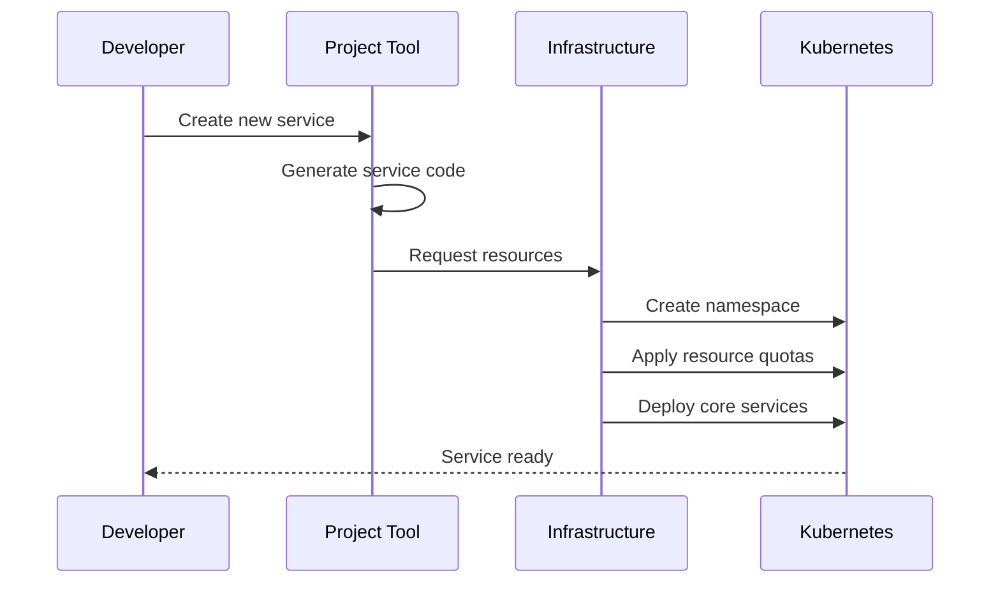
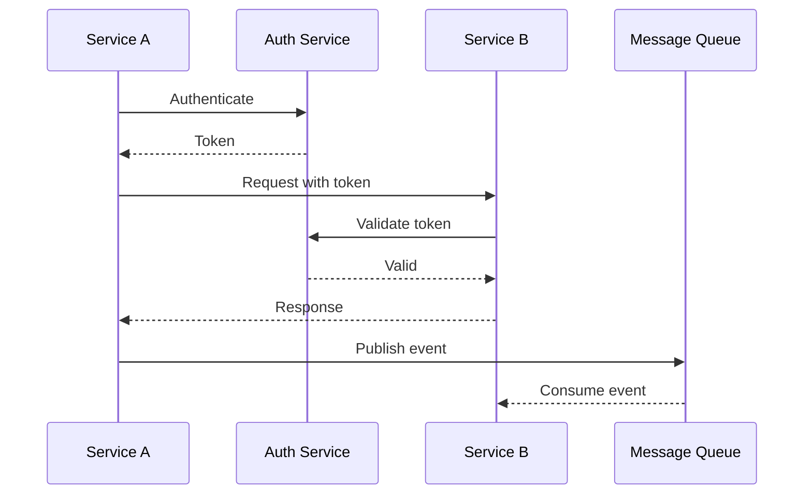

# Architecture Overview

## System Architecture

The KMP Shared Infrastructure platform is designed as a modular, scalable system that provides core infrastructure components while maintaining isolation between different projects and services.

## Key Components

### 1. Resource Isolation
- Namespace-based isolation
- Resource quotas per project
- Network policies
- Role-based access control

### 2. Core Infrastructure
Each project gets isolated instances of:
- Databases (TimescaleDB, Neo4j, Redis)
- Message queues (Kafka topics)
- Cache layers
- Storage buckets

### 3. Common Libraries
Modular libraries that can be included as needed:
- Authentication/Authorization
- Storage access
- Message handling
- Monitoring integration

### 4. Development Tools
- Project templates
- Service generators
- Local development environment
- Testing frameworks

## Design Principles

### 1. Modularity
- Components are loosely coupled
- Services can choose which modules to use
- Easy to add new components
- Support for custom implementations

### 2. Scalability
- Horizontal scaling of services
- Distributed data storage
- Message queue scaling
- Cache layer distribution

### 3. Maintainability
- Centralized configuration
- Automated deployment
- Comprehensive monitoring
- Self-healing capabilities

### 4. Security
- Zero-trust network model
- Service-to-service authentication
- Encrypted communication
- Secrets management

## Component Integration

### Service Creation

### Service Communication

## Resource Management

### Compute Resources
- CPU and memory limits per namespace
- Autoscaling policies
- Resource quotas

### Storage Resources
- Storage class allocation
- Backup policies
- Retention policies

### Network Resources
- Ingress/Egress policies
- Load balancing
- Service mesh integration

## Monitoring and Operations

### Observability
- Metrics collection
- Distributed tracing
- Log aggregation
- Alert management

### Operations
- Automated deployment
- Rolling updates
- Backup/Restore
- Disaster recovery

## Security Architecture

### Authentication
- Service identity
- User authentication
- Token management
- Certificate management

### Authorization
- Role-based access
- Policy enforcement
- Resource permissions
- Audit logging

## Extensibility Points

### Custom Modules
- Custom authentication providers
- Storage implementations
- Message handlers
- Monitoring integrations

### Configuration
- Environment-specific settings
- Feature flags
- Resource limits
- Network policies

## Development Workflow

### Local Development
- Local kubernetes cluster
- Service simulation
- Data seeding
- Test data management

### CI/CD Pipeline
- Automated testing
- Security scanning
- Resource validation
- Deployment automation
